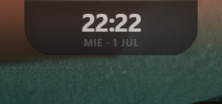
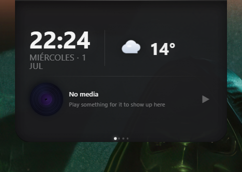
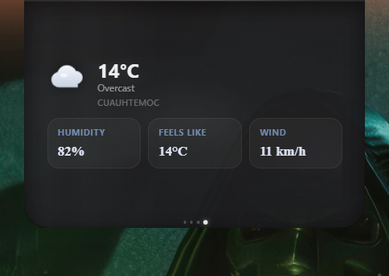
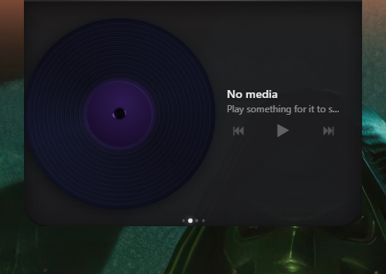
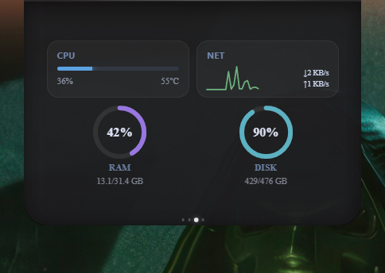

# Nimbo

> A glowing, always-on-top island overlay for Windows — clock, weather, media controls and system stats in one edge-snapping pill. Built with **Tauri 2 + React + TypeScript + Rust**.

[](https://github.com/SergioLugoPM/windows-island/releases)
[](https://tauri.app)
[](https://www.rust-lang.org)
[](https://react.dev)
[](https://www.typescriptlang.org)
[](LICENSE)
[](../../releases/latest)

---

## Screenshots


*Idle state: clock (or now-playing title), passthrough cursor, soft accent-colored glow*


*Full mode: clock + weather + media, all at once*


*Dedicated weather mode with an animated SVG backdrop that matches current conditions*


*Media mode: spinning vinyl, live audio visualizer, transport controls*


*System stats: CPU/RAM/battery rings, network throughput, disk usage*

## Why?

Windows' built-in clock gets hidden by fullscreen apps. The taskbar widgets are heavy. Existing Dynamic Island clones for Windows are either abandoned or feel like browser extensions. **Nimbo** is a small native widget that:

- Floats above everything (`set_always_on_top`)
- Ignores your mouse until you reach the screen edge (`SetIgnoreCursorEvents` + `GetCursorPos` polling)
- Snaps to a pill shape on the top edge of every active monitor
- Glows with a soft halo sampled from your desktop wallpaper's dominant color
- Reads the actual Windows Media Session (`Windows.Media.Control` WinRT API) — works with Spotify, YouTube, Edge, anything

## Features

### Five view modes (cycle by click or scroll wheel)
| Mode | Shows |
|---|---|
| **Idle** | Clock (or the current song title while something plays), transparent, mouse passes through |
| **Full** | Clock + weather + media, all at once — the default entry mode |
| **Media** | Vinyl disc animation + real audio visualizer + track info + transport buttons |
| **Stats** | CPU / RAM / battery rings, network throughput, disk usage |
| **Weather** | Larger weather card with an animated SVG backdrop (sun rays, drifting clouds, rain, snow) that matches current conditions |
| **Settings** | Long-press (600 ms) to open |

### Two themes
| Theme | Look |
|---|---|
| **Dark** | Solid dark pill with a wallpaper-accent-colored glow — default |
| **Light** | Frosted white pill with soft shadow, same accent glow |

### Clock
- **S / M / L** sizes — resizes the OS window in real time
- 12h/24h format, optional seconds

### System integration
- **Multi-monitor** — an island on every active display
- **Tray icon** with right-click menu (Show / Hide / Quit)
- **Single-instance lock** via named mutex (`CreateMutexW`)
- **Esc** to instantly collapse to idle from any mode

## Install

Grab the latest installer from [**Releases**](../../releases/latest):

| File | Notes |
|---|---|
| `Nimbo_0.3.0_x64_en-US.msi` | Standard Windows installer |
| `Nimbo_0.3.0_x64-setup.exe` | NSIS (smaller, faster) |

> **Note:** the binary is not code-signed yet, so Windows SmartScreen will show a warning the first time. Click "More info" → "Run anyway". If you'd rather verify the source, build from scratch (see below).

### System requirements
- Windows 10 (build 19041+) or Windows 11
- WebView2 Runtime — preinstalled on Win11, auto-installed on Win10

## Build from source

```bash
git clone https://github.com/SergioLugoPM/windows-island
cd windows-island
npm install
cargo tauri dev     # hot-reload dev mode
cargo tauri build   # release installers in src-tauri/target/release/bundle/
```

Prerequisites:
- Rust stable (`rustup default stable`)
- Node 18+
- Windows 10 SDK + MSVC build tools

## Controls reference

| Action | Effect |
|---|---|
| Cursor reaches screen top (idle) | Expand to full mode |
| Click on island | Cycle modes (full → media → stats → weather → full…) |
| Scroll wheel over island | Same cycle, forward/backward |
| Long-press (600 ms) | Open settings panel |
| Esc | Instantly collapse to idle |
| Tray left-click | Toggle visibility |
| Tray right-click | Context menu (Show / Hide / Quit) |

## Architecture

```
┌────────────────────────────────────────────────────────────────┐
│  WebView2  (transparent, no decorations, always-on-top)        │
│  ┌──────────────────────────────────────────────────────────┐  │
│  │  React 18 + Framer Motion                                │  │
│  │  ┌──── Island.tsx (state machine) ────────────────────┐  │  │
│  │  │   Clock  WeatherView + WeatherIcon/Backdrop         │  │  │
│  │  │   MediaView + Vinyl + AudioVisualizer               │  │  │
│  │  │   StatsView + RingStat                              │  │  │
│  │  └────────────────────────────────────────────────────┘  │  │
│  └──────────────────────────────────────────────────────────┘  │
│  ▲  invoke('cmd', …)                                           │
└──┼─────────────────────────────────────────────────────────────┘
   │
┌──┴─────────────────────────────────────────────────────────────┐
│  Tauri 2 / Rust backend (lib.rs + modules)                     │
│  ┌──────────────────────────────────────────────────────────┐  │
│  │  resize_window / resize_anchor_bottom / snap_to_edge     │  │
│  │  set_cursor_passthrough  get_cursor_screen_pos            │  │
│  │  get_work_area_bottom    get_windows_theme                │  │
│  │  get_media_info / toggle_play_pause / skip_*  (media.rs)  │  │
│  │  get_weather (30-min cache, weather.rs)                   │  │
│  │  get_system_stats — CPU/RAM/battery/net/disk (stats.rs)   │  │
│  └──────────────────────────────────────────────────────────┘  │
│  ┌──── win_sys module (raw Win32 FFI) ──────────────────────┐  │
│  │  GetCursorPos  SystemParametersInfoW                     │  │
│  │  DwmSetWindowAttribute  CreateMutexW                      │  │
│  └──────────────────────────────────────────────────────────┘  │
└────────────────────────────────────────────────────────────────┘
```

## Tech stack

| Layer | Tech |
|---|---|
| Native shell | Tauri 2 (Rust) |
| Frontend | React 18, TypeScript, Vite |
| Animation | Framer Motion (spring physics) |
| Media (Win) | `windows` crate 0.58 — `Windows.Media.Control` namespace |
| Weather | wttr.in REST (no API key) |
| System stats | `sysinfo` 0.32 |
| Cursor / DWM | Raw Win32 FFI (`GetCursorPos`, `DwmSetWindowAttribute`, `SystemParametersInfoW`, `CreateMutexW`) |

## Interesting problems solved

A handful of things that took more thought than expected:

### 1. Cursor passthrough only at the screen edge
The island sits at the top of the screen but must let clicks pass through when idle. Solution: `set_ignore_cursor_events(true)` permanently, plus a cursor-position poll in JS that re-enables events the instant the cursor enters the top few pixels of the screen — gated by a real Tauri capabilities file so `currentMonitor`/`outer_position` calls actually succeed.

### 2. `windows` crate version conflicts
Tauri internally depends on a newer `windows` crate than the one used for `Windows.Media.Control`. Using `HWND` from one in an API call from the other fails at compile time. Fix: raw `extern "system"` FFI for DWM / cursor / mutex calls. `HWND` is `repr(transparent)` over `isize`, so `std::mem::transmute_copy` extracts the value safely across crate versions.

### 3. Windows Media Session blocks Tokio
`IAsyncOperation::Status()` in the `windows` crate is not `Send`, so awaiting it in a `tokio::spawn` fails. Wrapped the WinRT calls in `tokio::task::spawn_blocking` and switched to synchronous status polling (`Status()` + `GetResults()`).

### 4. Pill-shaped window with antialiased corners
DWM fills the rectangular HWND, ignoring CSS `border-radius` — corners leak in transparent windows. Solution: keep the WebView2 window transparent, animate `border-radius` on the React root via Framer Motion. WebView2's compositor handles antialiasing per-frame.

### 5. A glow that isn't clipped by the pill's own rounded corners
`box-shadow` on an element is not clipped by that same element's `overflow: hidden` — only its *content* overflow is. That let the accent-colored halo bloom outward past the pill edges while everything drawn inside (vinyl art, backdrop animations) still stays clipped to the rounded shape.

### 6. Resize that stays anchored to the taskbar
The OS resize API preserves the top-left corner — change the size, the window grows downward. For a mode that lives above the taskbar, we read `SystemParametersInfoW(SPI_GETWORKAREA)` and reposition so the **bottom** edge stays glued.

### 7. Single-instance lock without leaking the handle
Named mutex (`CreateMutexW`) with `Local\\Nimbo_SingleInstance_v1`. If `GetLastError() == ERROR_ALREADY_EXISTS`, exit silently. The handle is intentionally leaked — it lives for the process lifetime; the OS reclaims it on exit.

## Roadmap

Future ideas, if there's enough interest:
- More widgets (timer, pomodoro, calendar peek, app launcher)
- Direct Spotify / Discord / Slack integrations
- Custom theme editor
- Multi-monitor positioning memory
- Linux / macOS ports (Tauri-based but Win32 FFI needs platform-specific replacements)

## License

[MIT](LICENSE) — do whatever you want, attribution appreciated.

## Acknowledgments

- **Apple** for the original Dynamic Island design language on iPhone 14 Pro
- **Tauri team** for making sub-4MB native apps possible
- **wttr.in** for keyless weather

---

Made with 🦀 + ⚛ by [@SergioLugoPM](https://github.com/SergioLugoPM)
